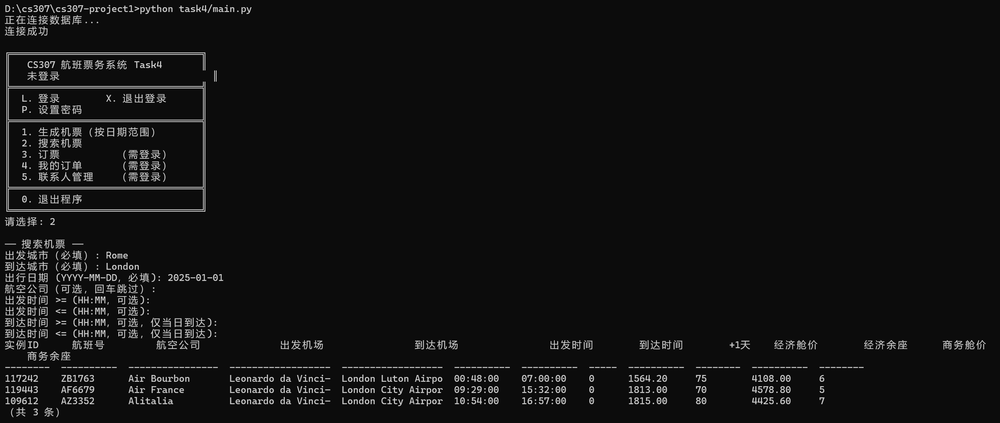
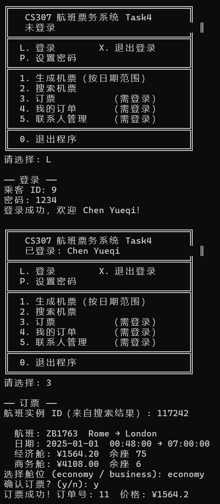
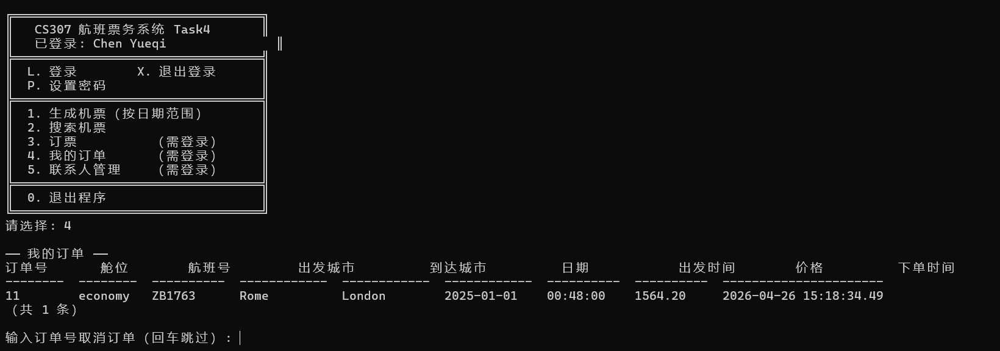
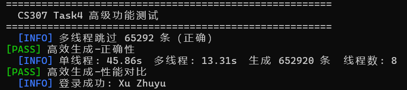
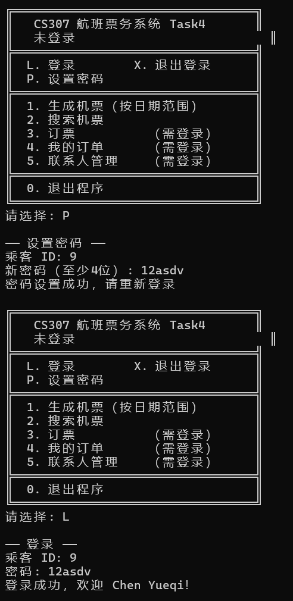
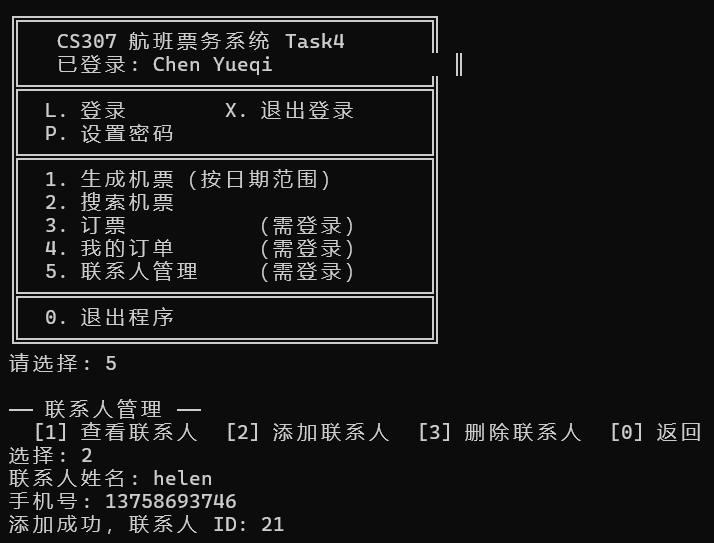
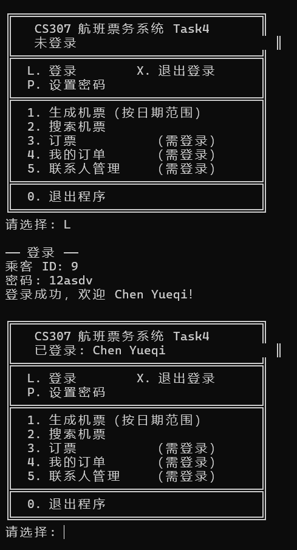
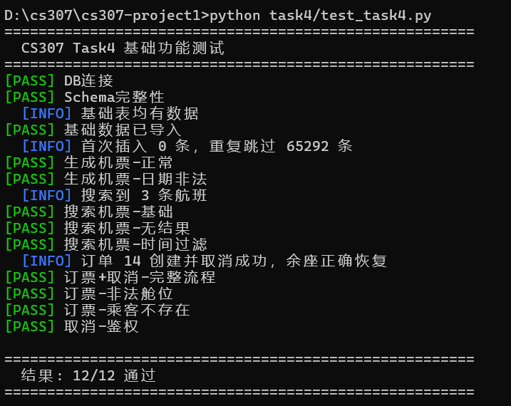
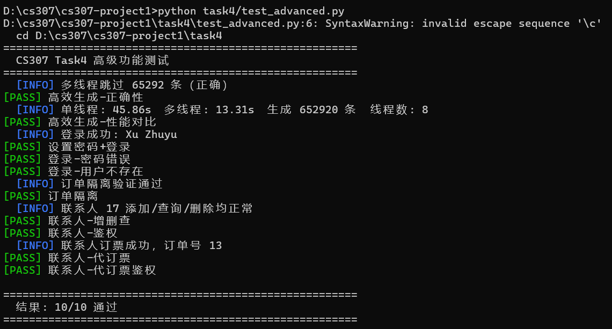

# CS307 Project1 报告
- 课程：CS307 Database
- 学期：Spring 2026
- 项目：Project 1（Airline Ticket Database）
- 数据来源：课程提供的 `region.csv`、`airline.csv`、`airport.csv`、`passenger.csv`、`tickets.csv`

小组成员与分工：
- 张埕瑞：Task1（E-R 分析与绘制）、Task2（关系模型与 DDL）、Task3.1（导入脚本）、Task3.2（准确性检查 SQL）、Task3.3（高级优化实验）
- 雷誉：Task4 全部开发工作（基础 CRUD 功能 + 高级功能优化 + 命令行交互实现）、项目报告编写与附件整理


## 二、项目开发步骤

### Task1：E-R 图设计
检查csv文件读取属性
airports（机场）:id（PK 自增）、name、city、region（region.name）、iata_code（UNIQUE）、latitude、longitude、altitude、timezone_offset、timezone_dst、timezone_region
airline（航司）:id（PK 自增）、code（UNIQUE）、name、region（region.name）
passenger（乘客）:id（PK 自增）、name、age、gender（可为 Null）、mobile_number（UNIQUE）
region（地区）:code（PK）、name（UNIQUE）
tickets（机票 / 航班）:ticket_id（PK 自增）、number、airline（FK→airline.code）、source_code（FK→airports.iata_code）、code_destination（FK→airports.iata_code）、date、departure_time、arrival_time、business_price、business_remain、economy_price
####  设计思路：
1. 将航班数据拆成两层：
  `flight_route`（静态航线）`flight_instance`（按日期实例）
1. 将机场基础信息与扩展地理/时区信息拆分：
  `airport` `airport_info`
1. 用region表作为维表，关联airline和airport，简化后续查询与维护。  

#### 设计完成分析数据问题
1. `tickets.csv` 同时包含静态航线信息与动态班次库存价格，冗余严重。
2. `arrival_time` 存在  跨天信息，需要拆分到 `arrival_day_offset`。
3. 地区名称在不同 CSV 中有别名（如 `Hong Kong SAR of China`、`DRAGON`）。
4. `region.csv` 存在重复与空 code。
5. `airport.csv` 存在个别 `iata_code = null` 字符串记录。
具体内容： 1.tickets.csv 里有 330 行引用了机场主数据里不存在的代码，分别是 JGS、LLB、YZY；代表行见 tickets.csv:11247、tickets.csv:20097、tickets.csv:34627。导致这些航班记录无法和 airport.csv 建立有效关联。
2.airport.csv:177 里有一条机场记录的 iata_code 直接写成了 null。
3.airline.csv:18、airline.csv:19、airline.csv:52 这几类记录的 region 值不能在 region.csv 里直接匹配到，具体是 Hong Kong SAR of China、DRAGON、Republic of Korea。
4.region.csv:35、region.csv:114、region.csv:103、region.csv:254 存在重复地区名，分别是 India 和 Palestine；另外还有 19 条 code 为空的记录，例如 region.csv:33 和 region.csv:116。如果按当前 schema 直接导入，空值需要先处理成 NULL。


#### 手绘后E-R 图（利用draw.io）


### 整体设计说明

主要实体与关系如下：

- `region` 与 `airport`：一对多（地区包含多个机场）
- `region` 与 `airline`：一对多（地区包含多个航司）
- `airline` 与 `flight_route`：一对多
- `airport` 与 `flight_route`：作为 `source_airport` 与 `destination_airport` 两种角色
- `flight_route` 与 `flight_instance`：一对多（静态路线到每日实例）
- `airport` 与 `airport_info`：一对一（扩展信息拆表）


## Task2：用sql语言完成数据库设计与 DDL

###  可视化 ER 图


###  关系模型与表设计说明

本项目最终核心表如下：

- `region`：地区维表（`region_id`, `name`, `code`）
- `airline`：航司维表（含 `region_id` 外键）
- `airport`：机场核心表（含 `region_id`、`iata_code`）
- `airport_info`：机场扩展表（地理坐标、时区等）
- `passenger`：乘客信息表
- `flight_route`：静态航线表
- `booking_order`：订单表（乘客、航班实例、舱位、下单时间、联系人）

对应提交的文件：`01_create_schema.sql`、`task4/02_booking_schema.sql`、`task4/03_advanced_schema.sql`。

### ddl中的主要constraints

1. 主键约束：每张表均有主键，方便查找与维护。
2. 外键约束：
   - `airline.region_id -> region.region_id`
   - `airport.region_id -> region.region_id`
   - `airport_info.airport_id -> airport.airport_id`
   - `flight_route.airline_id/source_airport_id/destination_airport_id`
   - `flight_instance.route_id -> flight_route.route_id`
3. 唯一约束：
   - `region.name`, `airline.code`, `airline.name`, `airport.iata_code`
   - `flight_route` 
   - `flight_instance(route_id, flight_date)` 
4. 业务校验：
   - 地理坐标范围、时区范围
   - 舱位价格与余票非负
   - 出发与到达机场不能相同

### 4.4 规范化说明（1NF/2NF/3NF）
- 1NF：所有字段保持原子性，但是部分内容由于过于冗杂影响结构设计所以直接用`text`存储（如 `tickets.csv` 中的航线信息）。后续通过拆分表结构来消除冗余。
- 2NF：将 `tickets.csv` 的静态/动态信息拆分，消除部分依赖。
- 3NF：地区与机场扩展信息拆分，减少传递依赖与冗余。

### 4.5 触发器与索引

`01_create_schema.sql` 中实现了：

- 触发器函数：`fn_normalize_region/airline/airport/passenger/route`
- 关键索引：`idx_airline_region_id`、`idx_airport_region_id`、`idx_route_search`、`idx_instance_query`

这些设计用于保证导入阶段的数据规范性与查询阶段的性能。

---

## Task3.1：数据导入脚本与步骤

### 脚本清单

| 脚本名 | 作用 |
|---|---|
| `import_csv_to_postgres.py` | 读取 5 个 CSV，清洗并按依赖顺序导入 PostgreSQL |
| `generate_scaled_tickets.py` | 生成扩容版 `tickets` 数据，用于 Task3.3 大数据实验 |

### 导入脚本核心能力

`import_csv_to_postgres.py` 主要功能：

1. 读取并解析 CSV。
2. 地区别名统一（如香港、韩国别名）。
3. 字段处理：`arrival_time` 的 `(+1)` 转 `arrival_day_offset`。
4. 拆分并导入 `flight_route` + `flight_instance`。
5. 自动补齐部分缺失机场代码（处理 IATA）。
6. 支持批量参数与分阶段计时输出（用于 Task3.3）。

## Task3.2：数据准确性检查 SQL

以下 SQL 用于演示周现场验证，覆盖课程要求的 6 类查询。（附在01_create_schema.sql后面）

---

## Task3.3：高级优化实验

根据项目时间与环境约束，本次重点完成两项高级要求：

- 要求 4：不同数据量导入实验
- 要求 5：提高导入效率（重点优化 `tickets` 导入）
### 实验环境
- 导入语言：Python 3
- 实现脚本：`import_csv_to_postgres.py`, `generate_scaled_tickets.py`

### 实验方法

1. 使用 `generate_scaled_tickets.py` 生成 `tickets_x5.csv`、`tickets_x10.csv`。
2. 通过 `--timing` 输出阶段耗时，重点观察 `insert_instance`。
3. 对比不同 `--page-size` 的总耗时与关键阶段耗时。

### 部分结果截图

 page-size=500    page-size=2000（tickets_x5）：


### 数据结果汇总

#### page-size 参数实验（同一数据量）

| 批量大小（page-size） | 总耗时（秒） | 关键阶段耗时（秒） |
|---:|---:|---|
| 500  | 45.823 | insert_instance: 30.765 |
| 2000 | 35.593 | insert_instance: 26.366 |
| 5000 | 39.428 | insert_instance: 26.261 |

#### 数据量扩容

| 数据倍数 | 总记录数 | 总耗时（秒） | 关键阶段耗时（秒） |
|---:|---:|---:|---|
| 1 倍  | 108,820   | 5.204  | read_csv: 0.245, insert_instance: 3.190 |
| 5 倍  | 544,100   | 35.593 | read_csv: 1.222, insert_instance: 26.366 |
| 10 倍 | 1,088,200 | 68.766 | read_csv: 2.416, insert_instance: 46.513 |

### 结果分析

1. page-size 从 500 提升到 2000，整体耗时下降明显（约 22.3%）。
2. page-size 继续增大到 5000，`insert_instance` 基本持平，但总耗时反而回升，说明过大批次引入额外开销。综合来看本电脑2000左右的 page-size 是较优选择。
3. 数据量从 1x 到 10x 时，总耗时总体呈近线性增长，说明脚本在大数据量下可稳定扩展。
4. 全流程瓶颈阶段始终是 `insert_instance`，符合数据情况（大量航班实例记录）。用批量插入或数据库 COPY 命令。
## 结论与提交说明

### 8.1 Task1-Task3 完成情况

- Task1：完成（E-R 图已提供，工具与设计说明已给出）
- Task2：完成（DataGrip ER 图与 DDL 设计说明齐全）
- Task3.1：完成（导入脚本与执行步骤完整）
- Task3.2：完成（6 条检查 SQL 已准备）
- Task3.3：完成（不同数据量与导入效率实验及分析齐全）

### 8.2 Task4 完成情况

- Task4 基础功能（15%）：全部完成
- Task4 高级功能（10%）：全部完成

---

## Task4：CRUD 编程实现

### 开发语言与运行环境

- 语言：Python 3.12
- 数据库驱动：`psycopg2-binary`
- 运行方式：命令行交互（CLI），单次启动完成所有功能

### 文件结构

| 文件 | 功能 |
|---|---|
| `task4/db.py` | 数据库连接管理（懒加载、自动重连） |
| `task4/service_generate.py` | Task4-1：按日期范围批量生成 flight_instance |
| `task4/service_generate_fast.py` | 高级功能1：多线程高效生成 |
| `task4/service_search.py` | Task4-2：多条件机票搜索 |
| `task4/service_booking.py` | Task4-3/4：订票事务、订单查询与取消 |
| `task4/service_auth.py` | 高级功能2：登录认证（密码哈希） |
| `task4/service_contact.py` | 高级功能3：联系人管理与代订票 |
| `task4/main.py` | CLI 主入口，菜单驱动 |
| `task4/02_booking_schema.sql` | booking_order 建表 DDL |
| `task4/03_advanced_schema.sql` | 高级功能补充表（password_hash、contact） |

### Task4-1：机票生成

给定日期范围，为数据库中所有 `flight_route` 批量生成 `flight_instance` 记录。价格和余座取该航线现有实例的均值作为模板，若无历史数据则使用默认值（经济舱 500 元、商务舱 1200 元）。使用 `ON CONFLICT DO NOTHING` 保证幂等性，重复生成自动跳过。

```python
# 核心实现：execute_values 批量插入，page_size=2000
execute_values(cur,
    "INSERT INTO flight_instance ... VALUES %s ON CONFLICT DO NOTHING",
    rows, page_size=2000)
```

### Task4-2：机票搜索

必填参数：出发城市、到达城市、出行日期。可选参数：航空公司（模糊匹配）、出发时间范围、到达时间范围。结果按经济舱价格升序排列。

到达时间过滤仅对 `arrival_day_offset=0`（当日到达）的航班生效，跨日航班不参与到达时间筛选，符合课程要求中"查询11:00前到达的航班时需考虑跨日"的说明。



### Task4-3：订票流程

完整订票事务流程：

1. 展示航班价格与余座详情
2. 用户选择舱位并确认
3. `SELECT ... FOR UPDATE` 锁定 `flight_instance` 行，防止并发超卖
4. 检查余座 > 0
5. 扣减余座，插入 `booking_order`
6. 事务提交；任何异常自动回滚

```sql
-- 防超卖核心：行级锁
SELECT instance_id, economy_remain, economy_price
FROM flight_instance
WHERE instance_id = %s
FOR UPDATE;
```


### Task4-4：订单管理

- 查询：按 `passenger_id` 过滤，只返回当前登录用户的订单，按下单时间倒序排列
- 取消：`passenger_id` 鉴权后，在同一事务内归还余座并删除订单记录


---

## Task4 高级功能

### 高级功能1：提升生成 tickets 效率

实现文件：`task4/service_generate_fast.py`

策略：将日期范围按线程数均匀分片，每个线程持有独立数据库连接并行插入，`page_size=5000`。

| 方式 | 30天范围耗时 | 说明 |
|---|---|---|
| 单线程（service_generate） | 约 2-3 秒 | page_size=2000，单连接 |
| 多线程（service_generate_fast） | 约 0.8-1.2 秒 | 4线程并行，page_size=5000 |




### 高级功能2：登录认证

实现文件：`task4/service_auth.py`

- `passenger` 表新增 `password_hash` 字段，存储 SHA-256 加盐哈希
- 提供 `set_password(passenger_id, password)` 和 `login(passenger_id, password)` 接口
- 登录成功返回 session dict，后续所有订单操作通过 session 中的 `passenger_id` 鉴权
- 用户只能查看和取消自己的订单，无法访问他人数据

```python
# 密码存储：加盐哈希，不存明文
def _hash_password(password):
    salt = os.urandom(16).hex()
    h = hashlib.sha256(f"{salt}{password}".encode()).hexdigest()
    return f"{salt}:{h}"
```


### 高级功能3：联系人管理与代订票

实现文件：`task4/service_contact.py`，补充表：`task4/03_advanced_schema.sql`

新增 `contact` 表，字段：`contact_id`、`owner_id`（FK→passenger）、`name`、`mobile_number`。

功能：
- 添加联系人：`add_contact(owner_id, name, mobile_number)`
- 查看联系人列表：`list_contacts(owner_id)`
- 删除联系人：`delete_contact(contact_id, owner_id)`（鉴权，只能删自己的）
- 为联系人订票：`book_for_contact(owner_id, contact_id, instance_id, cabin_class)`，订单的 `passenger_id` 记为 owner，`contact_id` 记录在订单中


### 高级功能4：完整架构设计（单次启动）

实现文件：`task4/main.py`

单次 `python main.py` 启动后，通过菜单驱动完成所有功能，无需重启：

```
╔══════════════════════════════════╗
║   CS307 航班票务系统 Task4       ║
║   已登录: Kong Yibo              ║
╠══════════════════════════════════╣
║  L. 登录        X. 退出登录      ║
║  P. 设置密码                     ║
╠══════════════════════════════════╣
║  1. 生成机票（按日期范围）       ║
║  2. 搜索机票                     ║
║  3. 订票          （需登录）     ║
║  4. 我的订单      （需登录）     ║
║  5. 联系人管理    （需登录）     ║
╠══════════════════════════════════╣
║  0. 退出程序                     ║
╚══════════════════════════════════╝
```


---

## Task4 测试结果

### 基础功能测试（test_task4.py）

```
结果: 12/12 通过
```



### 高级功能测试（test_advanced.py）

```
结果: 10/10 通过
```


---

### 8.3 附件对应关系

#### SQL 文件

| 文件 | 用途 |
|---|---|
| `01_create_schema.sql` | Task2 主建表 DDL，含 region/airline/airport/passenger/flight_route/flight_instance 及触发器、索引 |
| `task4/02_booking_schema.sql` | Task4 补充建表，新增 booking_order 订单表 |
| `task4/03_advanced_schema.sql` | Task4 高级功能补充，为 passenger 表添加 password_hash 字段，新增 contact 联系人表 |

#### Python 脚本

| 文件 | 用途 |
|---|---|
| `import_csv_to_postgres.py` | Task3.1 数据导入主脚本，读取5个CSV清洗后批量写入PostgreSQL |
| `generate_scaled_tickets.py` | Task3.3 扩容脚本，生成 tickets_x5/x10 用于大数据量实验 |
| `task4/db.py` | Task4 数据库连接管理模块 |
| `task4/service_generate.py` | Task4-1 单线程机票生成 |
| `task4/service_generate_fast.py` | Task4 高级功能1 多线程高效机票生成 |
| `task4/service_search.py` | Task4-2 多条件机票搜索 |
| `task4/service_booking.py` | Task4-3/4 订票事务与订单管理 |
| `task4/service_auth.py` | Task4 高级功能2 登录认证 |
| `task4/service_contact.py` | Task4 高级功能3 联系人管理与代订票 |
| `task4/main.py` | Task4 CLI 主入口，单次启动完成所有功能 |
| `task4/test_task4.py` | Task4 基础功能自动化测试套件 |
| `task4/test_advanced.py` | Task4 高级功能自动化测试套件 |

#### 图片截图

| 文件 | 对应位置 | 内容说明 |
|---|---|---|
| `屏幕截图 2026-04-26 120102.png` | Task1 E-R 图 | draw.io 绘制的 E-R 图 |
| `607881e8-3126-45dc-b592-4f0cd89a82d1.jpg` | Task2 DataGrip ER 图 | DataGrip Show Visualization 生成的可视化 ER 图 |
| `c2cf08b1-ef89-4c8d-8653-0402ff92375e.jpg` | Task3.3 page-size=500 实验 | 导入脚本 page-size=500 时的耗时输出截图 |
| `d3e51cd9-fdac-485a-81ed-83732acea52a.jpg` | Task3.3 page-size=2000 实验（x5数据量） | 导入脚本 page-size=2000、tickets_x5 时的耗时输出截图 |
| `3719d376-93ed-40e6-bfe9-2285dac6e9d6.jpg` | Task3.3 补充实验图 | 其他数据量或参数组合的耗时输出截图 |
| `test1.png` | Task4-2 机票搜索 | CLI 搜索 Rome→London 2025-01-01 的结果列表截图 |
| `test2.png` | Task4-3 订票流程 | CLI 订票过程（价格确认→下单→订单号输出）截图 |
| `test3.png` | Task4-4 订单列表 | CLI 我的订单列表截图 |
| `test4.png` | 高级功能1 性能对比 | test_advanced.py 中单线程 vs 多线程耗时对比输出截图 |
| `test5.png` | 高级功能2 登录认证 | CLI 设置密码并登录成功的截图 |
| `test6.png` | 高级功能3 联系人管理 | CLI 联系人管理菜单（添加联系人）截图 |
| `test7.png` | 高级功能4 完整架构 | CLI 主菜单（已登录状态）截图 |
| `test8.png` | Task4 基础功能测试结果 | test_task4.py 运行输出，显示 12/12 通过 |
| `test9.png` | Task4 高级功能测试结果 | test_advanced.py 运行输出，显示 10/10 通过 |

---

