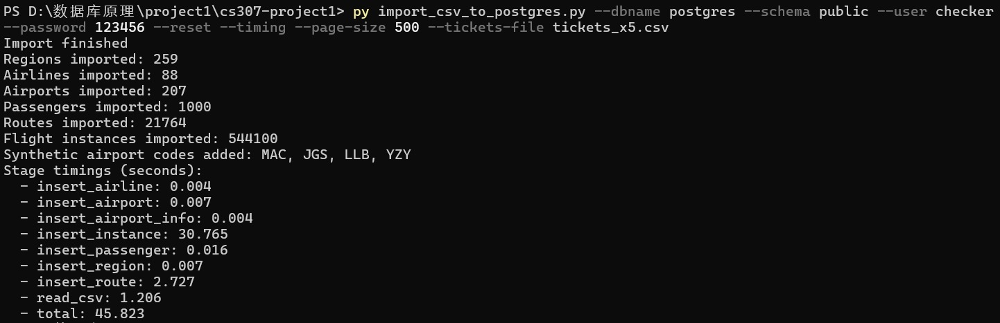
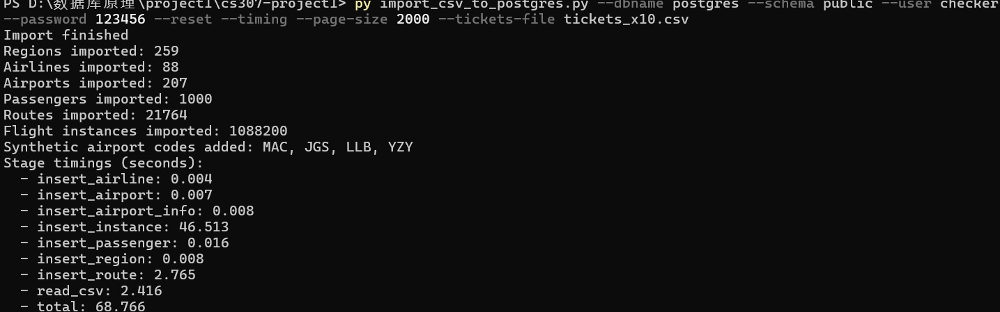

# CS307 Project1 报告
- 课程：CS307 Database
- 学期：Spring 2026
- 项目：Project 1（Airline Ticket Database）
- 数据来源：课程提供的 `region.csv`、`airline.csv`、`airport.csv`、`passenger.csv`、`tickets.csv`

小组成员与分工-：张埕瑞：Task1（E-R 分析与绘制）、Task2（关系模型与 DDL）、Task3.1（导入脚本）、Task3.2（准确性检查 SQL）Task3.3（高级优化实验）雷誉：

## 二、项目开发步骤

### Task1：E-R 图设计
检查csv文件读取属性
airports（机场）:id（PK 自增）、name、city、region（region.name）、iata_code（UNIQUE）、latitude、longitude、altitude、timezone_offset、timezone_dst、timezone_region
airline（航司）:id（PK 自增）、code（UNIQUE）、name、region（region.name）
passenger（乘客）:id（PK 自增）、name、age、gender（可为 Null）、mobile_number（UNIQUE）
region（地区）:code（PK）、name（UNIQUE）
tickets（机票 / 航班）:ticket_id（PK 自增）、number、airline（FK→airline.code）、source_code（FK→airports.iata_code）、code_destination（FK→airports.iata_code）、date、departure_time、arrival_time、business_price、business_remain、economy_price
####  设计思路：
1. 将航班数据拆成两层：
  `flight_route`（静态航线）`flight_instance`（按日期实例）
1. 将机场基础信息与扩展地理/时区信息拆分：
  `airport` `airport_info`
1. 用region表作为维表，关联airline和airport，简化后续查询与维护。  

#### 设计完成分析数据问题
1. `tickets.csv` 同时包含静态航线信息与动态班次库存价格，冗余严重。
2. `arrival_time` 存在  跨天信息，需要拆分到 `arrival_day_offset`。
3. 地区名称在不同 CSV 中有别名（如 `Hong Kong SAR of China`、`DRAGON`）。
4. `region.csv` 存在重复与空 code。
5. `airport.csv` 存在个别 `iata_code = null` 字符串记录。
具体内容： 1.tickets.csv 里有 330 行引用了机场主数据里不存在的代码，分别是 JGS、LLB、YZY；代表行见 tickets.csv:11247、tickets.csv:20097、tickets.csv:34627。导致这些航班记录无法和 airport.csv 建立有效关联。
2.airport.csv:177 里有一条机场记录的 iata_code 直接写成了 null。
3.airline.csv:18、airline.csv:19、airline.csv:52 这几类记录的 region 值不能在 region.csv 里直接匹配到，具体是 Hong Kong SAR of China、DRAGON、Republic of Korea。
4.region.csv:35、region.csv:114、region.csv:103、region.csv:254 存在重复地区名，分别是 India 和 Palestine；另外还有 19 条 code 为空的记录，例如 region.csv:33 和 region.csv:116。如果按当前 schema 直接导入，空值需要先处理成 NULL。

#### 手绘后E-R 图（利用draw.io）

### 整体设计说明

主要实体与关系如下：

- `region` 与 `airport`：一对多（地区包含多个机场）
- `region` 与 `airline`：一对多（地区包含多个航司）
- `airline` 与 `flight_route`：一对多
- `airport` 与 `flight_route`：作为 `source_airport` 与 `destination_airport` 两种角色
- `flight_route` 与 `flight_instance`：一对多（静态路线到每日实例）
- `airport` 与 `airport_info`：一对一（扩展信息拆表）

## Task2：用sql语言完成数据库设计与 DDL

###  可视化 ER 图

###  关系模型与表设计说明

本项目最终核心表如下：

- `region`：地区维表（`region_id`, `name`, `code`）
- `airline`：航司维表（含 `region_id` 外键）
- `airport`：机场核心表（含 `region_id`、`iata_code`）
- `airport_info`：机场扩展表（地理坐标、时区等）
- `passenger`：乘客信息表
- `flight_route`：静态航线表
- `flight_instance`：航班实例表（日期、舱位价格、余票）
这里是你要写的关于task4的设计
对应提交的文件：`01_create_schema.sql`。

### ddl中的主要constraints

1. 主键约束：每张表均有主键，方便查找与维护。
2. 外键约束：
   - `airline.region_id -> region.region_id`
   - `airport.region_id -> region.region_id`
   - `airport_info.airport_id -> airport.airport_id`
   - `flight_route.airline_id/source_airport_id/destination_airport_id`
   - `flight_instance.route_id -> flight_route.route_id`
3. 唯一约束：
   - `region.name`, `airline.code`, `airline.name`, `airport.iata_code`
   - `flight_route` 
   - `flight_instance(route_id, flight_date)` 
4. 业务校验：
   - 地理坐标范围、时区范围
   - 舱位价格与余票非负
   - 出发与到达机场不能相同

### 4.4 规范化说明（1NF/2NF/3NF）
- 1NF：所有字段保持原子性，但是部分内容由于过于冗杂影响结构设计所以直接用`text`存储（如 `tickets.csv` 中的航线信息）。后续通过拆分表结构来消除冗余。
- 2NF：将 `tickets.csv` 的静态/动态信息拆分，消除部分依赖。
- 3NF：地区与机场扩展信息拆分，减少传递依赖与冗余。

### 4.5 触发器与索引

`01_create_schema.sql` 中实现了：

- 触发器函数：`fn_normalize_region/airline/airport/passenger/route`
- 关键索引：`idx_airline_region_id`、`idx_airport_region_id`、`idx_route_search`、`idx_instance_query`

这些设计用于保证导入阶段的数据规范性与查询阶段的性能。

---

## Task3.1：数据导入脚本与步骤

### 脚本清单

| 脚本名 | 作用 |
|---|---|
| `import_csv_to_postgres.py` | 读取 5 个 CSV，清洗并按依赖顺序导入 PostgreSQL |
| `generate_scaled_tickets.py` | 生成扩容版 `tickets` 数据，用于 Task3.3 大数据实验 |

### 导入脚本核心能力

`import_csv_to_postgres.py` 主要功能：

1. 读取并解析 CSV。
2. 地区别名统一（如香港、韩国别名）。
3. 字段处理：`arrival_time` 的 `(+1)` 转 `arrival_day_offset`。
4. 拆分并导入 `flight_route` + `flight_instance`。
5. 自动补齐部分缺失机场代码（处理 IATA）。
6. 支持批量参数与分阶段计时输出（用于 Task3.3）。

## Task3.2：数据准确性检查 SQL

以下 SQL 用于演示周现场验证，覆盖课程要求的 6 类查询。（附在01_create_schema.sql后面）

---

## Task3.3：高级优化实验

根据项目时间与环境约束，本次重点完成两项高级要求：

- 要求 4：不同数据量导入实验
- 要求 5：提高导入效率（重点优化 `tickets` 导入）
### 实验环境
- 导入语言：Python 3
- 实现脚本：`import_csv_to_postgres.py`, `generate_scaled_tickets.py`

### 实验方法

1. 使用 `generate_scaled_tickets.py` 生成 `tickets_x5.csv`、`tickets_x10.csv`。
2. 通过 `--timing` 输出阶段耗时，重点观察 `insert_instance`。
3. 对比不同 `--page-size` 的总耗时与关键阶段耗时。

### 部分结果截图

 page-size=500    page-size=2000（tickets_x5）：

### 数据结果汇总

#### page-size 参数实验（同一数据量）

| 批量大小（page-size） | 总耗时（秒） | 关键阶段耗时（秒） |
|---:|---:|---|
| 500  | 45.823 | insert_instance: 30.765 |
| 2000 | 35.593 | insert_instance: 26.366 |
| 5000 | 39.428 | insert_instance: 26.261 |

#### 数据量扩容

| 数据倍数 | 总记录数 | 总耗时（秒） | 关键阶段耗时（秒） |
|---:|---:|---:|---|
| 1 倍  | 108,820   | 5.204  | read_csv: 0.245, insert_instance: 3.190 |
| 5 倍  | 544,100   | 35.593 | read_csv: 1.222, insert_instance: 26.366 |
| 10 倍 | 1,088,200 | 68.766 | read_csv: 2.416, insert_instance: 46.513 |

### 结果分析

1. page-size 从 500 提升到 2000，整体耗时下降明显（约 22.3%）。
2. page-size 继续增大到 5000，`insert_instance` 基本持平，但总耗时反而回升，说明过大批次引入额外开销。综合来看本电脑2000左右的 page-size 是较优选择。
3. 数据量从 1x 到 10x 时，总耗时总体呈近线性增长，说明脚本在大数据量下可稳定扩展。
4. 全流程瓶颈阶段始终是 `insert_instance`，符合数据情况（大量航班实例记录）。用批量插入或数据库 COPY 命令。
## 结论与提交说明

### 8.1 Task1-Task3 完成情况

- Task1：完成（E-R 图已提供，工具与设计说明已给出）
- Task2：完成（DataGrip ER 图与 DDL 设计说明齐全）
- Task3.1：完成（导入脚本与执行步骤完整）
- Task3.2：完成（6 条检查 SQL 已准备）
- Task3.3：完成（不同数据量与导入效率实验及分析齐全）

### 8.2 附件对应关系

- Task1 图：`屏幕截图 2026-04-26 120102.png`
- Task2 DataGrip ER：`607881e8-3126-45dc-b592-4f0cd89a82d1.jpg`
- Task3.3 评测图：
  - `c2cf08b1-ef89-4c8d-8653-0402ff92375e.jpg`
  - `d3e51cd9-fdac-485a-81ed-83732acea52a.jpg`
  - `3719d376-93ed-40e6-bfe9-2285dac6e9d6.jpg`
- DDL 文件：`01_create_schema.sql`
- 导入脚本：`import_csv_to_postgres.py`
- 扩容脚本：`generate_scaled_tickets.py`

---

